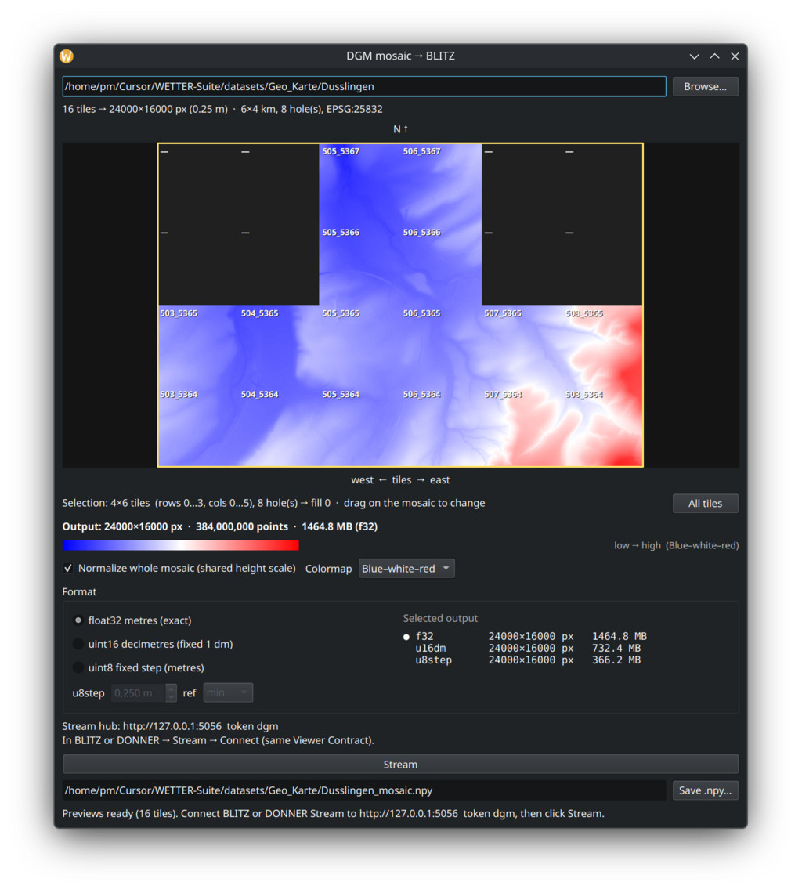

# DGM mosaic

Part of [WETTER](https://wetter.mess.engineering).

Drop a folder of DGM GeoTIFF tiles, preview the mosaic, select a rectangle,
**Stream** to BLITZ and DONNER at once.

**Download:** [latest release](https://github.com/PiMaV/dgm-mosaic/releases/latest)
— `DGM-vX.Y.Z-linux-x86_64` or `DGM-vX.Y.Z-windows-x86_64.exe`.

1. Download the file for your system.
2. Linux: `chmod +x DGM-vX.Y.Z-linux-x86_64`
3. Run it. Drop a tile folder (or Browse…).
4. Wait for the preview bar to finish, pick tiles, click **Stream**.
5. Connect viewers (token `dgm` on both):
   - **BLITZ** → `http://127.0.0.1:5056` — height plane `(1, H, W)`.
   - **DONNER** → `http://127.0.0.1:5057` — elevation **surface** `(nZ, H, W)`
     (one cube per map cell; no filled columns).

Heights stay in metres (`float32`). Optional **uint16** stores **decimetres**
(fixed 0.1 m/DN). **Bin** (default **2×**, or 4/8/16× block mean) shrinks large
mosaics when you want — full Bin sends full size to both hubs.

**Example tiles:** LGL Baden-Württemberg
[DGM25 GeoTIFF](https://opengeodata.lgl-bw.de/#/(sidenav:product/dgm025))
(open data). Unzip a tile folder and drop it on the window.

GNU GPL v3. See [LICENSE](LICENSE).

For agents: [`docs/llm-brief.md`](docs/llm-brief.md).
