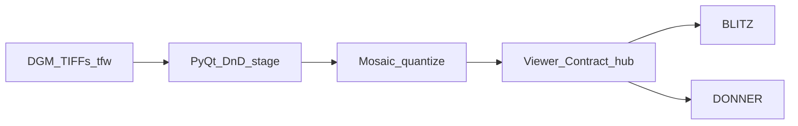

# DGM mosaic architecture

## Roles

- **Product binary** (PyInstaller): PyQt window + embedded Viewer Contract hub
  on one port (Engine.IO/Socket.IO + `.npy` GET).
- **Optional Go CLI** builds the same mosaic math headless and can run a hub.
- **Viewers** connect as Stream clients; no peer mesh.

## TIFF profile

Classic GeoTIFF / LGL naming and `.tfw` placement. Preview is a downscaled
tile mosaic; export uses the selected tile rectangle and chosen dtype.
