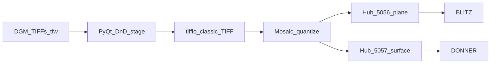

# DGM mosaic architecture

## Roles

- **Product binary** (PyInstaller): PyQt window + icon + **two** Viewer Contract
  hubs (Engine.IO/Socket.IO + `.npy` GET). Progress bar during preview load and
  mosaic build. **Stream** fills both hubs from the same selection.
- **TIFF:** `tiffio` reads uncompressed classic TIFF strips or tiles (no OpenCV /
  GDAL). Preview downsamples with numpy; optional per-tile normalize and
  named colormaps.
- **Optional Go CLI** builds the same mosaic math headless and can run a hub.
- **Viewers** connect as Stream clients; no peer mesh.

## Stream shapes

| Hub | Port | File | Shape | Client |
|-----|------|------|-------|--------|
| Plane | 5056 | `mosaic.npy` | `(1, H, W)` | BLITZ |
| Surface | 5057 | `surface.npy` | `(nZ, H, W)` uint16 | DONNER |

Surface: one non-zero code per map column at the elevation bin (`v = bin + 1`).
No filled pillars. `height_surface_thw` in `mosaic.py`.

## TIFF profile

LGL DGM GeoTIFFs are typically **tiled** float32. Placement from `.tfw` or LGL
filename. Preview is a downscaled tile mosaic; export uses the selected tile
rectangle and chosen dtype. Optional **bin** (block mean) then wrap as
`(1, H, W)` for BLITZ; the same metres feed the DONNER surface.
