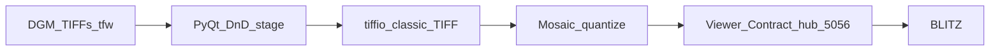

# DGM mosaic architecture

## Roles

- **Product binary** (PyInstaller): PyQt window + icon + embedded Viewer Contract
  hub on one port (Engine.IO/Socket.IO + `.npy` GET). Progress bar during preview
  load and mosaic build.
- **TIFF:** `tiffio` reads uncompressed classic TIFF strips or tiles (no OpenCV /
  GDAL). Preview downsamples with numpy; optional per-tile normalize and
  named colormaps.
- **Optional Go CLI** builds the same mosaic math headless and can run a hub.
- **Viewers:** primary client is **BLITZ** (height plane). DONNER is not a
  DGM terrain target.

## Stream shape

| Hub | Port | File | Shape | Client |
|-----|------|------|-------|--------|
| Plane | 5056 | `mosaic.npy` | `(1, H, W)` | BLITZ |

## TIFF profile

LGL DGM GeoTIFFs are typically **tiled** float32. Placement from `.tfw` or LGL
filename. Preview is a downscaled tile mosaic; export uses the selected tile
rectangle and chosen dtype. Optional **bin** (block mean) then wrap as
`(1, H, W)` for the Viewer Contract.
