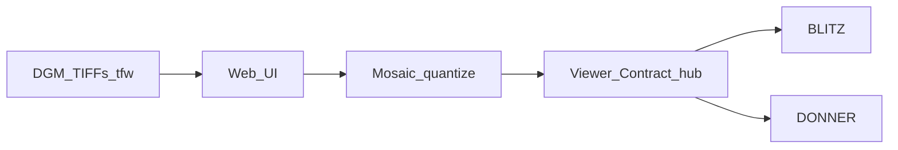

# DGM mosaic architecture

## Roles

- **Host binary** binds one port: HTTP UI + Engine.IO/Socket.IO + `.npy` GET.
- **Hub** implements the WETTER Viewer Contract (same events as WOLKE / EVT).
- **Viewers** connect as Stream clients; no peer mesh.

## TIFF profile

Classic TIFF only (magic 42). Single sample/pixel, uncompressed strips. Sample formats uint/int/float × 8/16/32-bit → float32 canvas. GeoTIFF tags ignored; placement from `.tfw` or LGL filename.
